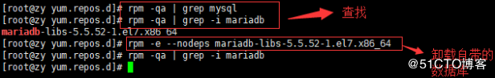
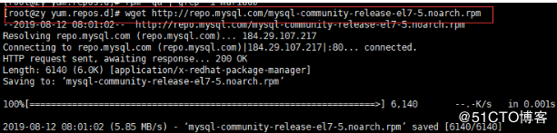
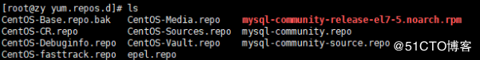
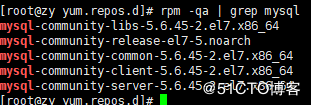
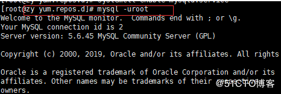
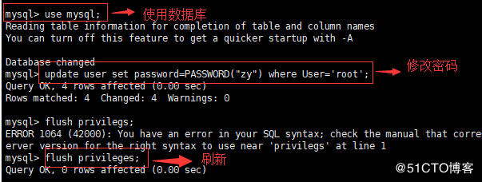
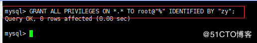
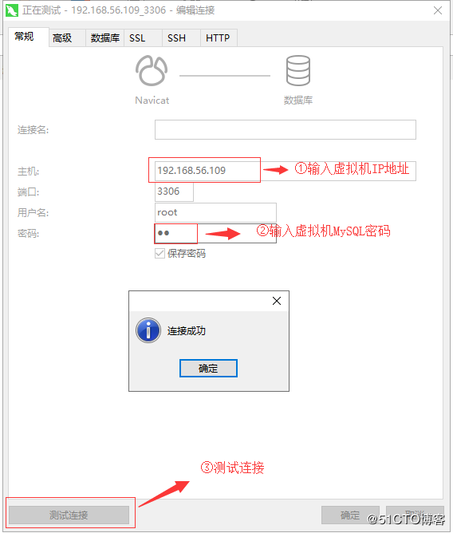

### linux安装 node

+ 方式一

  1. wget+地址

  2. 解压缩

     xz  -d 名字

     tar -xvf 名字

+ 方式二

  手动下载--上官网下载linux版本node放到自己的目录

  解压缩

### 为node配置环境变量

1. 进入node安装目录的bin文件夹
2. pwd获取 当前路径
3. cd 回到自己的家目录
4. vi .bashrc 配置环境变量
5. 利用export PATH = 获取的路径:PATH
6. .+空格+.bashrc 重新载入配置

### linux安装mysql   https://blog.51cto.com/14497235/2428992

> 1. 查找虚拟机是否有mysql数据库，并查找删除自带的数据库，并确认
>
>    
>
> 2. 下载mysql安装包文件（**wget http:*//repo.mysql.com/mysql-community-release-el7-5.noarch.rpm***）
>
>    
>
> 3. 安装mysql-community-release-el7-5.noarch.rpm包（**rpm -ivh mysql-community-release-el7-5.noarch.rpm**）)
>
> ​    安装完成之后，会在 /etc/yum.repos.d/ 目录下新增 mysql-community.repo 、mysql-community-source.repo 两个 yum 源文件。  
>
> ​	
>
>  4.安装MySQL（yum install mysql-server）
>
>  5.检查MySQL是否安装成功（rpm -qa | grep mysql）
>
>  
>
>  6.启动MySQL服务（几种方式，一般为了方便会设置开机启动）
>
>   ①systemctl start mysqld.service #启动 mysql 
>
>   ②systemctl restart mysqld.service #重启 mysql 
>
>   ③systemctl stop mysqld.service #停止 mysql 
>
>   ④systemctl enable mysqld.service #设置 mysql 开机启动
>
>  7.登录MySQL（第一次没有密码）
>
> 
>
>  8.设置密码，并刷新（使用自己的密码）
>
> 
>
>  9.设置远程主机登录（只许修改最后的“”内的密码）
>
> 
>
> 10.使用本机MySQL工具测试链接（这里使用的是Navicat）
>
> 

### nginx.conf

